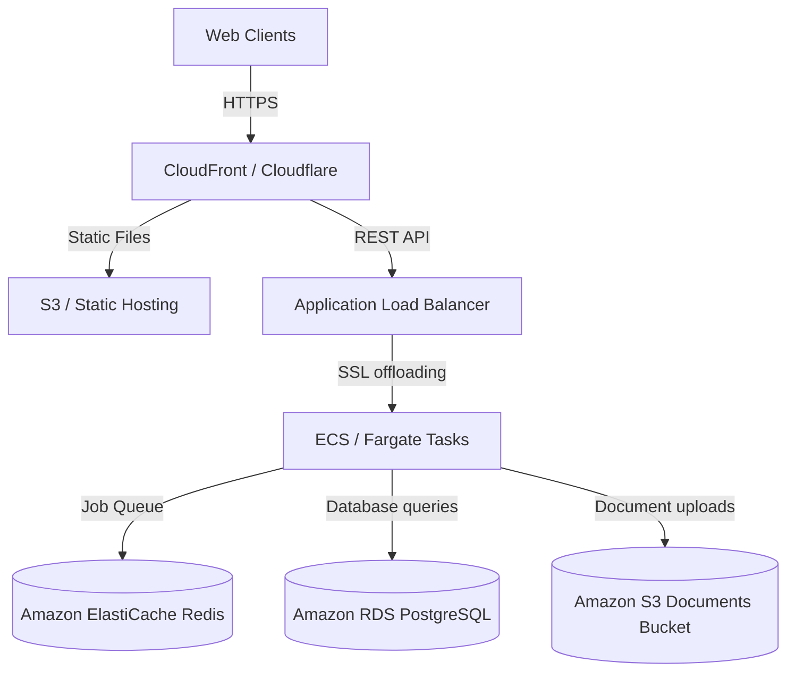

# Deployment Instructions - Clinical Prediction Engine

This guide describes how to configure, run, and scale PulseFlow AI in production-ready settings.

---

## 🐋 Docker Compose Deployment (Local/Staging)

The system is pre-configured to run PostgreSQL, Redis, backend APIs, and React frontend microservices concurrently.

1. **Prepare Environment variables**:
   ```bash
   cp .env.example .env
   ```
   *Edit `.env` to customize passwords, ports, and JWT keys.*

2. **Launch Services**:
   ```bash
   docker-compose up -d --build
   ```

3. **Verify Health Check**:
   Probes verify DB and Redis connection states:
   - Base health: `curl http://localhost:5000/health`
   - Database status: `curl http://localhost:5000/health/database`
   - Redis status: `curl http://localhost:5000/health/redis`

4. **Initialize Database & Seed Data**:
   Migrate database schemas and pre-populate roles, permissions, hospitals, and users:
   ```bash
   docker-compose exec backend npx prisma db push
   docker-compose exec backend npm run prisma:seed
   ```
   *After seeding, authenticate using default logins (e.g. `doctor@metro.org`) and password `password123`.*

---

## 🌐 Production Cloud Deployment Guide

For AWS, GCP, or Azure environments, follow clean cloud architecture guidelines.



### 1. Database (Amazon RDS PostgreSQL)
- **Engine**: PostgreSQL v15+
- **Backup**: Enable automated daily backups with multi-AZ replication.
- **Connection pooling**: Use PgBouncer in front of PostgreSQL to handle high concurrency.

### 2. Caching & Queue Broker (Amazon ElastiCache Redis)
- **Engine**: Redis v7.0+
- **Security**: Deploy inside private subnets, enabling transit encryption (TLS) and auth tokens.

### 3. Container Orchestration (AWS ECS Fargate / EKS)
- **Services split**:
  - Run the API service tasks answering public HTTP requests.
  - Run separate worker tasks running only queue worker listeners (`npm run start` with workers initialized) to isolate execution lifecycles.
- **Autoscaling**: Scale API tasks on CPU/Memory utilization, and worker tasks on queue length metrics from Redis.

### 4. File Storage (Amazon S3)
- **Configuration**: Set `STORAGE_PROVIDER=S3` in environment settings.
- **S3 Settings**: Populate `AWS_ACCESS_KEY_ID`, `AWS_SECRET_ACCESS_KEY`, `AWS_REGION`, and `AWS_S3_BUCKET`.
- **HIPAA Storage Rules**: Enable S3 server-side encryption (SSE-KMS), block public read permissions, and serve files only using short-lived pre-signed URLs (generated via `S3StorageProvider.ts`).

---

## 🔒 Healthcare Compliance & Security Checklist

When deploying healthcare software dealing with Protected Health Information (PHI), enforce:

1. **Encryption**: Enforce TLS v1.3 for all in-transit REST traffic. Enable Encryption-at-Rest on RDS database volumes and S3 storage buckets.
2. **Access Limits**: Store access tokens strictly in short-lived headers and refresh tokens in HTTP-only, secure, SameSite=Strict cookies.
3. **Session Rotation**: Enabled refresh token rotation invalidates compromised active sessions immediately.
4. **Audit Trails**: All clinical mutations (Patient creation, vitals logging, visit consultation records) write immutable records to the `AuditLog` table. Ensure audit tables are exported to compliance log aggregators regularly.
